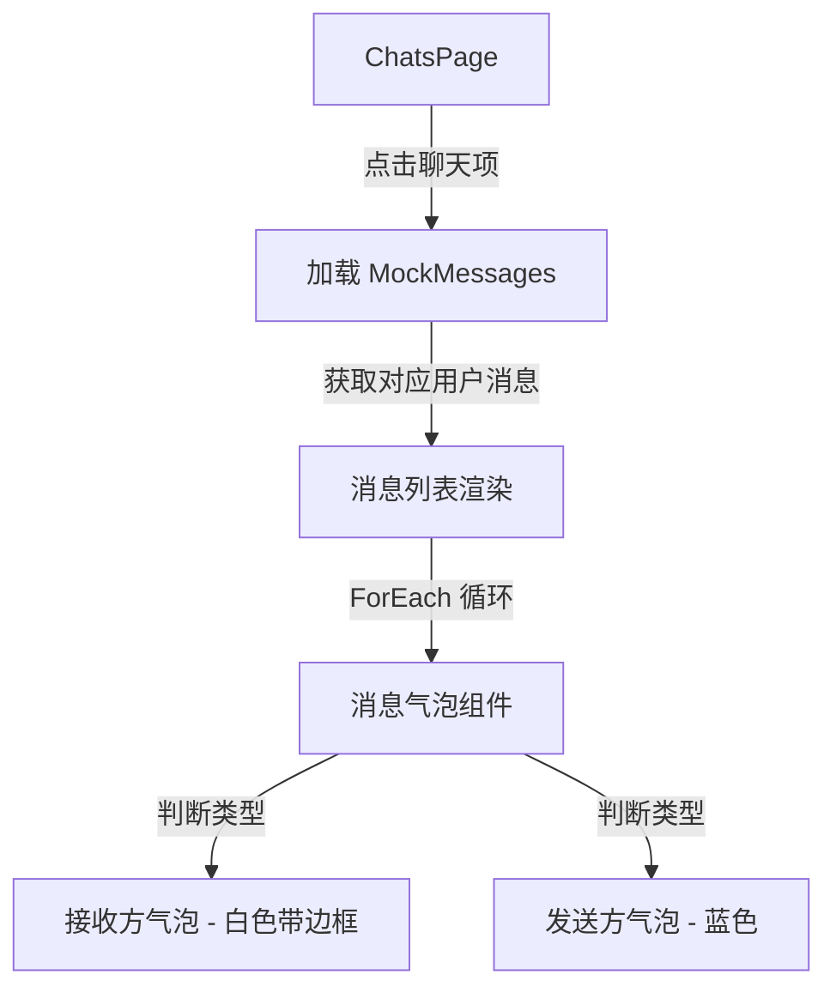

## 用户需求

修改 DEVELOPMENT_PLAN.md 中 3.2 消息气泡组件的 Mock 数据，为当前20个用户各自Mock 15条消息，然后完善消息气泡组件功能并确保编译通过。

## 产品概述

为 Telegram CJMP 应用的聊天详情页实现完整的消息气泡组件，支持20个用户各自的15条模拟消息数据展示。

## 核心功能

- 为20个用户各自生成15条真实感的Mock消息数据
- 完善消息气泡组件，支持接收方（白色带边框）和发送方（蓝色）两种样式
- 根据用户点击的聊天项显示对应用户的消息历史
- 消息气泡支持动态渲染和列表滚动
- 确保项目编译通过

## 技术栈

- 开发语言：仓颉
- UI框架：仓颉UI (ohos.component)
- 状态管理：@State 装饰器

## 实现方案

### 整体策略

1. 创建独立的 Mock 数据文件，存储20个用户各15条消息的数据结构
2. 在 ChatsPage.cj 中根据选中的聊天名称加载对应的 Mock 消息
3. 使用 List + ForEach 循环渲染消息气泡列表
4. 保持现有的气泡样式（接收方白色带边框左对齐，发送方蓝色右对齐）

### 数据结构设计

- 扩展 Message 结构体，增加时间戳字段
- 创建 MockMessages 类，包含20个用户各15条消息的静态数据
- 使用 Map<String, Array<Message>> 结构存储用户与消息的映射关系

### 架构设计



## 目录结构

```
telegram_cjmp/lib/
├── pages/
│   ├── ChatsPage.cj          # [MODIFY] 聊天列表页，增加Mock消息数据和消息渲染逻辑
│   ├── ChatDetailPage.cj     # [MODIFY] 可选优化，调整消息数据结构
│   └── MockData.cj           # [NEW] Mock数据文件，存储20个用户各15条消息
docs/
└── DEVELOPMENT_PLAN.md       # [MODIFY] 更新3.2节的Mock数据说明
```

## 实现注意事项

- Mock消息内容需根据用户类型（群聊/私聊）生成符合场景的真实内容
- 消息时间戳需要合理分布，模拟真实对话场景
- 消息气泡使用 ForEach 渲染时需要确保 key 唯一性
- 保持仓颉语法正确性，注意 struct 和 class 的使用规范
- 颜色值使用十六进制格式，与现有代码风格一致