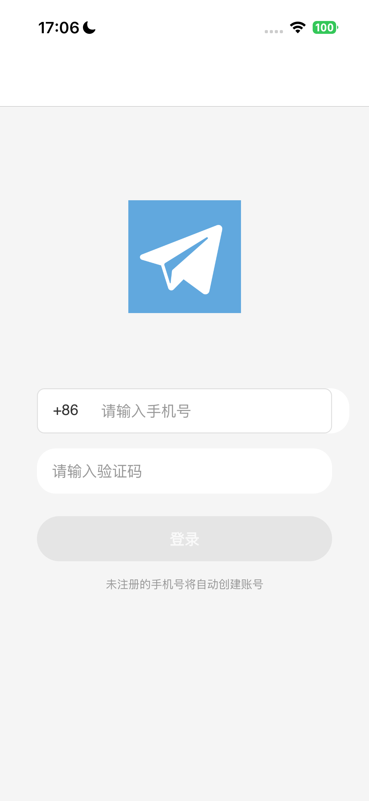
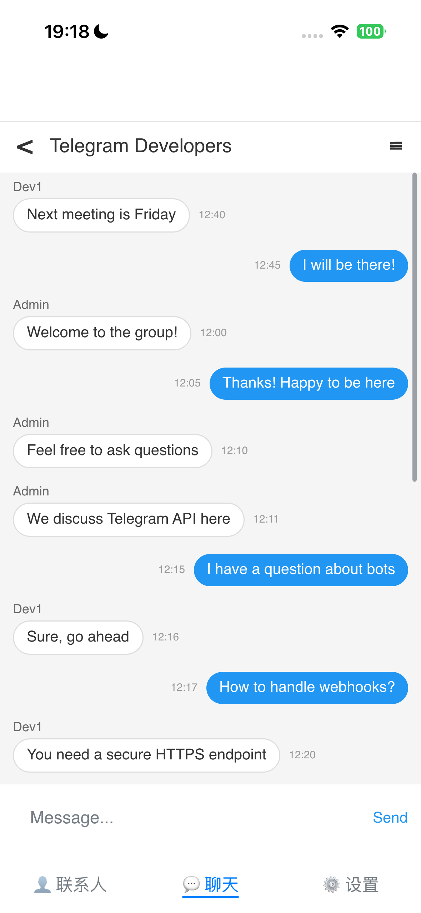
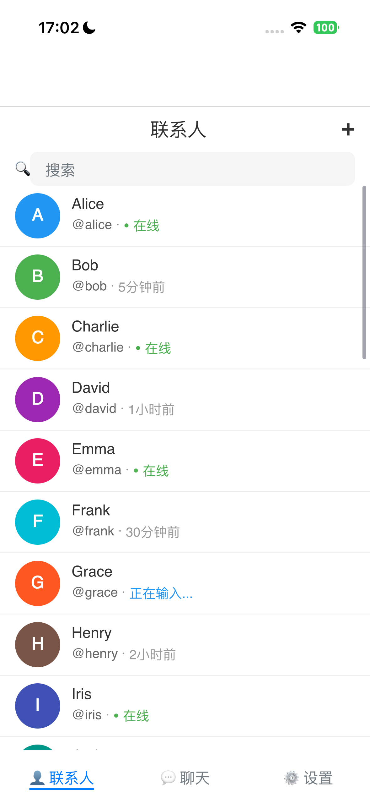
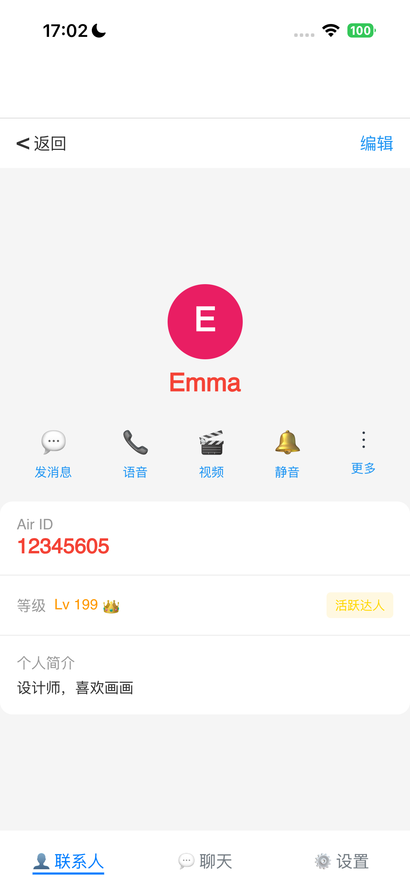
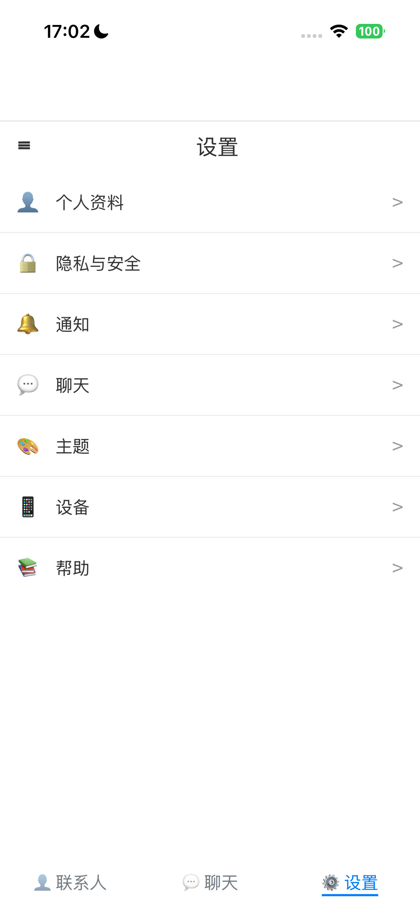
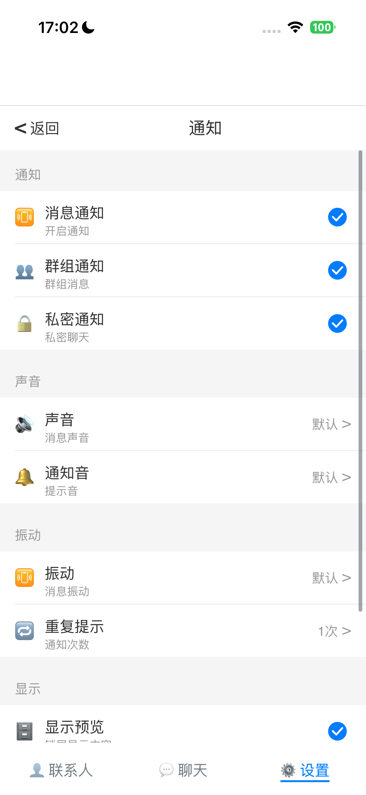
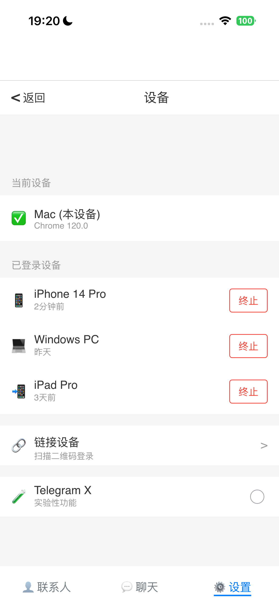
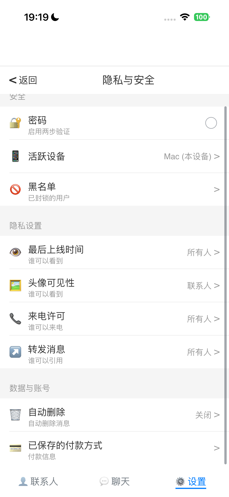

# IM CJMP

<div align="center">


[](LICENSE)

**基于 CJMP 跨平台框架开发的 IM 即时通信 Demo 应用**

[特性](#-主要特性) • [技术栈](#-技术栈) • [项目结构](#-项目结构) • [快速开始](#-快速开始) • [功能模块](#-功能模块) • [开发计划](#-开发计划)

</div>

---

## 📱 项目简介

IM CJMP 是一个使用**仓颉语言**和**CJMP 跨平台框架**开发的 IM 即时通讯应用演示版本。项目专注于展示完整的 UI 界面设计和用户交互流程，采用 Mock 数据模拟真实的聊天场景，**并且本项目完全由AI生成**，IDE选择CodeBuddy配合MiniMax M2.5模型，开发体验较为出色。

### 🎯 项目定位

- ✨ **UI/UX 展示**: 提供良好的 IM 界面设计和交互体验
- 🚀 **CJMP 验证**: 验证 CJMP 框架在跨平台 UI 开发中的能力
- 🎨 **设计参考**: 提供现代化的 UI 设计参考和最佳实践
- ⚡ **快速开发**: 借助 AI 工具 3 天完成 MVP 版本开发

### 🌟 核心特性

- ✅ 完整的登录认证流程（Mock 模式）
- ✅ 聊天列表与消息界面展示
- ✅ 文本和图片消息收发展示
- ✅ 联系人及详情页表展示
- ✅ 群组/频道展示
- ✅ 个人资料设置页面
- ✅ 跨平台支持（ Android / HarmonyOS / iOS ）

---

## 🛠️ 技术栈

| 层级 | 技术选型 |
|------|---------|
| **开发语言** | 仓颉 ( Cangjie ) |
| **UI 框架** | CJMP 声明式 UI |
| **目标平台** | Android / HarmonyOS / iOS |
| **网络服务** | Mock API Client |
| **开发工具** | CodeBuddy + MiniMax M2.5 / Keels |

### 依赖环境

- **仓颉编译器**: 0.62.3+
- **CJMP 框架**: 最新版本
- **Android NDK**: r26+
- **Xcode**: 15.0+ (iOS 开发)
- **DevEco Studio**: 6.0+ (HarmonyOS 开发)

---

## 📁 项目结构

```
telegram_cjmp/
├── lib/                          # 核心代码目录
│   ├── pages/                    # 页面组件
│   │   ├── LoginPage.cj          # 登录页面
│   │   ├── ChatsPage.cj          # 聊天列表页
│   │   ├── ChatDetailPage.cj     # 聊天详情页
│   │   ├── ContactsPage.cj       # 联系人列表页
│   │   ├── ContactDetailPage.cj  # 联系人详情页
│   │   ├── SettingsPage.cj       # 设置页
│   │   ├── ProfilePage.cj        # 个人资料页
│   │   ├── ThemePage.cj          # 主题设置页
│   │   ├── MockData.cj           # Mock 数据生成器
│   │   └── ApiService.cj         # Mock API 服务
│   ├── ability_mainability_entry.cj
│   ├── ability_stage.cj
│   ├── main_ability.cj
│   ├── module_entry_entry.cj
│   ├── index.cj                  # 入口文件
│   └── cjpm.toml                 # 项目配置
├── android/                      # Android 平台资源
│   └── app/
├── ios/                          # iOS 平台资源
│   └── telegram_cjmp.xcodeproj/
├── ohos/                         # HarmonyOS 平台资源
│   └── entry/
├── images/                       # 图片资源
├── build.sh                      # 构建脚本
├── build.bat                     # Windows 构建脚本
└── README.md                     # 项目文档
```
## Code lines
Total : 377 files, 10647 codes, 712 comments, 957 blanks, all 12316 lines

|language|files|code|comment|blank|total|
|---|---|---|---|---|---|
|Cangjie|26|5,435|522|518|6,475|
|XML|314|3,749|29|26|3,804|
|Markdown|2|529|0|216|745|
|JSON|14|290|0|8|298|
|Batch|2|179|27|60|266|
|Shell Script|1|172|28|40|240|
|Objective-C|3|107|43|33|183|
|Gradle|3|62|3|12|77|
|Java|4|49|11|20|80|
|TOML|1|41|0|6|47|
|C++|2|11|28|11|50|
|TypeScript|2|10|0|4|14|
|Java Properties|2|8|17|1|26|
|Properties|1|5|4|2|11|
---

## 🚀 快速开始

### 前置要求

确保已安装以下工具：

- ✅ 仓颉语言环境 (Cangjie 0.62.3+)
- ✅ CJMP 跨平台框架（Keels CLI）[链接](https://gitcode.com/CJMP/Tools)
- ✅ Android SDK & NDK (Android 开发)
- ✅ Xcode (iOS 开发)
- ✅ DevEco Studio (HarmonyOS 开发)

### 克隆项目

```bash
git clone https://github.com/WalteR-MittY-pro/IM-cjmp.git
cd telegram_cjmp
```

### 编译构建

#### Android 平台

```bash
# 使用构建脚本
./build.sh android

# 或使用 keels 命令
keels build apk
```

#### HarmonyOS 平台

```bash
# 进入 ohos 目录
cd ohos

# 使用 hvigorw 构建
./hvigorw assembleHap --mode module
```

#### iOS 平台

```bash
# 打开 Xcode 项目
open ios/telegram_cjmp.xcodeproj

# 或使用命令行构建
xcodebuild -project ios/telegram_cjmp.xcodeproj \
  -scheme telegram_cjmp \
  -configuration Debug \
  -destination 'platform=iOS Simulator,name=iPhone 15'
```

### 运行应用

1. **启动模拟器或连接真机**
2. **执行对应平台的构建命令**
3. **等待构建完成并自动安装到设备**

---

## 🎨 功能模块

### 1. 用户认证模块 🔐

完整的 Mock 登录流程，展示用户认证交互。

| 功能 | 状态 | 说明 |
|------|------|------|
| 手机号登录 | ✅ 完成 | 国家/地区选择 + 手机号输入 |
| 验证码验证 | ✅ 完成 | 固定验证码 "12345"，60 秒倒计时 |
| 会话持久化 | ✅ 完成 | Preferences 存储登录状态 |

**界面预览**:
```
┌─────────────────┐
│   欢迎使用      │
│                 │
│  [+86] 手机号   │
│  ____________   │
│                 │
│   下一步 →      │
└─────────────────┘
```

### 2. 聊天核心模块 💬

完整的聊天功能，支持文本和图片消息。

| 功能 | 状态 | 说明 |
|------|------|------|
| 聊天列表 | ✅ 完成 | 头像、名称、最后消息、未读数 |
| 文本消息 | ✅ 完成 | 发送/接收、消息状态、时间戳 |
| 图片消息 | ✅ 完成 | 相册选择、全屏查看、缩放 |
| 消息操作 | ✅ 完成 | 回复、编辑、删除、转发 |
| 表情符号 | ✅ 完成 | 表情选择器 |


### 3. 联系人模块 👥

联系人列表和管理功能。

| 功能 | 状态 | 说明 |
|------|------|------|
| 联系人列表 | ✅ 完成 | 字母分组、在线状态 |
| 搜索联系人 | ✅ 完成 | 实时过滤、高亮显示 |
| 添加联系人 | ✅ 完成 | 手机号/用户名添加 |
| 联系人详情 | ✅ 完成 | 信息展示、发起聊天 |

### 4. 群组/频道模块 👨‍👩‍👧‍👦

群组和频道的创建与管理界面。

| 功能 | 状态 | 说明 |
|------|------|------|
| 创建群组 | ✅ 完成 | 选择成员、设置名称 |
| 群组详情 | ✅ 完成 | 成员列表、权限设置 |
| 创建频道 | ✅ 完成 | 公开/私有频道 |
| 频道详情 | ✅ 完成 | 订阅者管理 |

### 5. 设置模块 ⚙️

个人资料和外观设置。

| 功能 | 状态 | 说明 |
|------|------|------|
| 个人资料 | ✅ 完成 | 编辑姓名、简介、头像 |
| 主题切换 | ✅ 完成 | 浅色/深色模式 |
| 外观设置 | ✅ 完成 | 字体大小、气泡样式 |
| 聊天背景 | ✅ 完成 | 自定义背景图 |

---

## 📋 Mock 数据说明

项目使用 Mock 数据来模拟真实的聊天场景，无需后端即可运行。

### Mock 数据范围

| 数据类型 | 数量 | 说明 |
|---------|------|------|
| 联系人 | 3-5 个 | 预置 Mock 联系人 |
| 聊天列表 | 5-10 个 | 包含个人、群组、频道 |
| 历史消息 | 每个聊天 20-50 条 | 文本、图片、系统消息 |
| 群组 | 2-3 个 | 不同类型的群组 |
| 频道 | 1-2 个 | 公开/私有频道 |

---

## 📸 界面截图
**Android/iOS/ohos三端功能及界面一致，**
<div align="center">

| 登录页面 | 聊天列表页面 | 聊天详情页面 |
|:--------:|:--------:|:--------:|
|  |  |  |

| 联系人页面 | 联系人详情页面 | 设置页面 |
|:------:|:--------:|:--------:|
|  |  |  |

| 设置-通知 | 设置-设备 | 设置-隐私安全 |
|:------:|:--------:|:--------:|
|  |  |  |

</div>

---

## 🔧 开发与调试

### 代码规范

遵循仓颉语言官方编码规范：

```bash
# 格式化代码
cjfmt lib/

# 代码检查
cjlint lib/
```

### 调试技巧

1. **日志输出**: 使用 `print()` 输出调试信息
2. **断点调试**: DevEco Studio 支持断点调试
3. **网络模拟**: Mock API 已内置延迟模拟

### 常见问题

#### Q: 如何修改 Mock 数据？

编辑 `lib/pages/MockData.cj` 文件，修改预置数据。

#### Q: 如何切换主题？

进入「设置」→ 「外观」→ 「主题」，选择浅色或深色模式，当前仅支持点击后🌛和🌞切换。

#### Q: 验证码是多少？

* 登陆手机固定为138 0000 0000
* 固定验证码：`12345`

---

## 🤝 贡献指南

欢迎提交 Issue 和 Pull Request！

### 贡献流程

1. Fork 本仓库
2. 创建特性分支 (`git checkout -b feature/AmazingFeature`)
3. 提交更改 (`git commit -m 'Add some AmazingFeature'`)
4. 推送到分支 (`git push origin feature/AmazingFeature`)
5. 开启 Pull Request

### 开发环境搭建

参考 [快速开始](#-快速开始) 章节。

---

## 📄 开源协议

本项目采用 MIT 协议开源。详见 [LICENSE](LICENSE) 文件。

---

## 🙏 致谢

- **仓颉语言**: 新一代编程语言
- **CJMP 框架**: 跨平台 UI 及逻辑框架
- **Telegram**: 优秀的即时通讯应用

---

## 📞 联系方式

- **项目地址**: https://github.com/WalteR-MittY-pro/IM-cjmp
- **问题反馈**: https://github.com/WalteR-MittY-pro/IM-cjmp/issues
- **邮箱**: example@email.com

---

<div align="center">

**如果这个项目对你有帮助，请给一个 ⭐ Star 支持！**

Made with ❤️ by WalteR-MittY-pro

</div>
